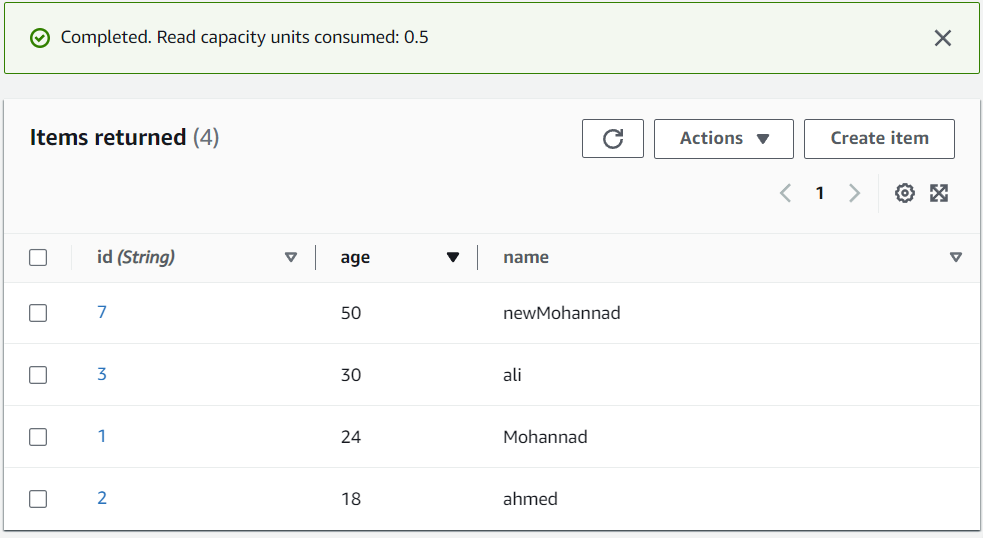

# serverless-api

## the table from aws

## the routes for the serverless api

## get all people ==> [get : /people]

## get a person by id ==> [get : /people/{id}]

## create a new person ==> [post : /people]

## update a person by id ==> [post : /people/{id}]

## delete a person by id ==> [post : /people/{id}]

